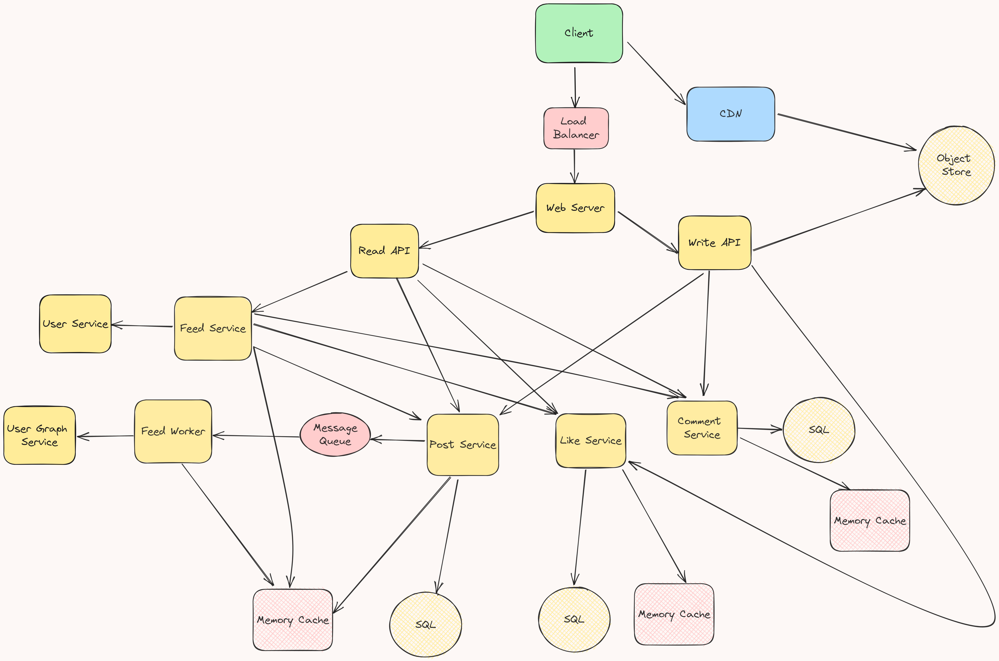

# Design the Instagram feed, likes and comments

## Step 1: Outline use cases and constraints

### Use cases

* **User** creates a post
    * **Service** pushes posts to followers
* **User** views the home feed (activity from people the user is following)
* **User** views the user feed (activity from the user)
* **User** likes a post
* **User** views likes of a post
* **User** comments a post
* **User** views comments of a post
* **Service** has high availability

### Constraints and assumptions

General

* Posting should be fast
    * Fanning out a post to all of your followers should be fast, unless you have millions of followers
* 2.35 billion active users
* 95 million posts per day or 3 million posts per month
    * Each post averages a fanout of 100 deliveries
    * 9.5 billion total posts delivered on fanout per day
    * 285 billion posts delivered on fanout per month
* 2 trillion read requests per month

Feed

* Viewing the feed should be fast
* Instagram is more read heavy than write heavy
    * Optimize for fast reads of the feed
* Ingesting posts is write heavy

Comments

* Viewing the post comments count should be fast
* Viewing top comments of a post should be fast

Likes

* Write-heavy
* Viewing the like count should be fast

## Step 2: Create a high level design



## Step 3: Design core components

### Use case: User posts a post

We could store the user's own posts to populate the user feed (activity from the user) in a [relational database](https://github.com/donnemartin/system-design-primer#relational-database-management-system-rdbms).

Delivering posts and building the home feed (activity from people the user is following) is trickier.  Fanning out posts to all followers (~100,000 posts delivered on fanout per second) will overload a traditional [relational database](https://github.com/donnemartin/system-design-primer#relational-database-management-system-rdbms).

We will store media such as photos or videos on an **Object Store**.

* The **Client** creates a post to the **Web Server**, running as a [reverse proxy](https://github.com/donnemartin/system-design-primer#reverse-proxy-web-server)
* The **Web Server** forwards the request to the **Write API** server
* The **Write API** stores the media in the **Object Store**
* The **Write API** sends the request to the **Post Service**
* The **Post Service** stores the post (media URL to **Object Store**, text and metadata) in the user's feed on a **SQL database** and **Memory Cache**
* The **Post Service** sends a message to **Message Queue**, which is received by **Feed Worker**, which does the following:
    * Queries the **User Graph Service** to find the user's followers stored in the **Memory Cache**
    * Stores the post in the *home feed of the user's followers* in a **Memory Cache**
        * O(n) operation:  1,000 followers = 1,000 lookups and inserts

If our **Memory Cache** is Redis, we could use a native Redis list with the following structure:

```
    post n+2                post n+1          post n
| 8 bytes  8 bytes  | 8 bytes  8 bytes  | 8 bytes  8 bytes |
| post_id  user_id  | post_id  user_id  | post_id  user_id |
```

The new post would be placed in the **Memory Cache**, which populates the user's home feed (activity from people the user is following).

For internal communications, we could use [Remote Procedure Calls](https://github.com/donnemartin/system-design-primer#remote-procedure-call-rpc).

REST API:
```bash
$ curl -X POST --data '{ "text": "hello world!", "media_id": "ABC987" }' https://instagram.com/api/v1/post
```

### Use case: User likes a post

* The **Client** posts a like request to the **Web Server**
* The **Web Server** forwards the request to the **Write API** server
* The **Write API** sends the request to the **Like Service**
* The **Like Service** stores the like in **SQL database**
* The **Like Service** increments the like counter in **Memory Cache**

If our **Memory Cache** is Redis, we could use a Redis [INCR command](https://redis.io/commands/incr/) with post_id as the key.

REST API:
```bash
$ curl -X PUT  https://instagram.com/api/v1/post/456/like
```

### Use case: User comments a post

* The **Client** posts a comment request to the **Web Server**
* The **Web Server** forwards the request to the **Write API** server
* The **Write API** sends the request to the **Comment Service**
* The **Comment Service** stores the like in **SQL database**
* The **Comment Service** increments the comment counter in **Memory Cache**
* The **Comment Service** invalidates the cache for the post in **Memory Cache**

REST API:
```bash
$ curl -X POST  https://instagram.com/api/v1/post/456/comment --data '{ "text": "hello world!", "reply_to": "comment_id" }'
```

### Use case: User views the home feed

* The **Client** sends a home feed request to the **Web Server**
* The **Web Server** forwards the request to the **Read API** server
* The **Read API** server contacts the **Feed Service**, which does the following:
    * Gets the feed data stored in the **Memory Cache**, containing post ids and user ids - O(1)
    * Queries the **Post Service** with a [multiget](http://redis.io/commands/mget) to obtain information about the post ids - O(n)
    * Queries the **User Service** with a multiget to obtain additional info about the user ids - O(n)
    * Queries the **Like Service** to get the like counts - O(n).
    * Queries the **Comment Service** to get the comments count O(n).

REST API:

```bash
$ curl https://instagram.com/api/v1/feed
```

Response:

```
{
    "user_id": "456",
    "post_id": "123",
    "text": "foo",
    "like_count": 42,
    "comment_count": 1
},
{
    "user_id": "789",
    "post_id": "456",
    "text": "bar",
    "like_count": 73,
    "comment_count": 4
},
{
    "user_id": "789",
    "post_id": "579",
    "text": "baz",
    "like_count": 631,
    "comment_count": 15
}
```

### Use case: User views the user feed

* The **Client** sends a user feed request to the **Web Server**
* The **Web Server** forwards the request to the **Read API** server
* The **Read API** server contacts the **Post Service**, which does the following:
    * Retrieves the user feed from the **SQL Database**
    * Queries the **Like Service** with a multiget to obtain the like counts - O(n).
    * Queries the **Comment Service** with a multiget to obtain the comment counts O(n).

The REST API would be similar to the home feed, except all posts would come from the user as opposed to the people the user is following.

### Use case: User views likes of a post

* The **Client** sends a post likes request to the **Web Server**
* The **Web Server** forwards the request to the **Read API** server
* The **Read API** server contacts the **Like Service**, which retrieves the post likes from the **SQL Database**

### Use case: User views comments of a post

* The **Client** sends a post comments request to the **Web Server**
* The **Web Server** forwards the request to the **Read API** server
* The **Read API** server contacts the **Like Service**, which does the following:
    * Retrieves the top post comments from the **Memory Cache**, together with reply counts.
    * In case of cache miss, retrieves the post comments from the **SQL Database** together with reply counts and stores them in **Memory Cache**

## Step 4: Scale the design

We will use horizontal scaling of **Web Servers**, and **Master-Slave Replicas** for **SQL Databases** and **Memory Caches**, and **SQL write master-slave failover** for **SQL Databases** to avoid single point of failure.

The **Feed Worker** is a potential bottleneck. We will use multiple instances of it to process the messages from the **Message Queue** in parallel. We could also use autoscaling based on the number of messages in the queue.

We should avoid fanning out posts from highly-followed users. Instead, we could search to find posts for highly-followed users, merge the search results with the user's home feed results, then re-order the posts at serve time and update the cache.

We'll also want to address the bottleneck with the **SQL Database**.

Although the **Memory Cache** should reduce the load on the database, it is unlikely the **SQL Read Replicas** alone would be enough to handle the cache misses. We'll probably need to employ additional SQL scaling patterns.

The high volume of writes would overwhelm a single **SQL Write Master-Slave**, also pointing to a need for additional scaling techniques.

* [Federation](https://github.com/donnemartin/system-design-primer#federation) - We will store Posts, Likes and Comments in separate databases.
* [Sharding](https://github.com/donnemartin/system-design-primer#sharding) - We will partition the data in all databases. The partition key for both Posts, Likes and Comments could be post_id. We could include shard ID into post_id so that we could find the shard where the post is stored by the post_id, as described [here](https://instagram-engineering.com/sharding-ids-at-instagram-1cf5a71e5a5c).
